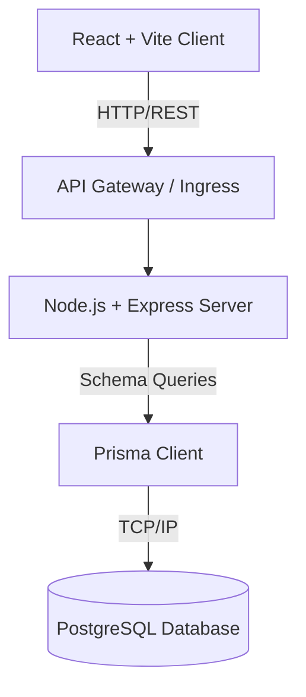
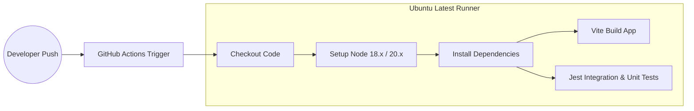
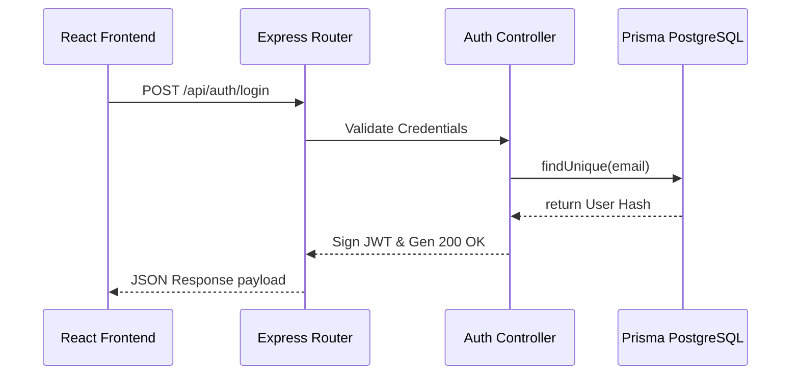
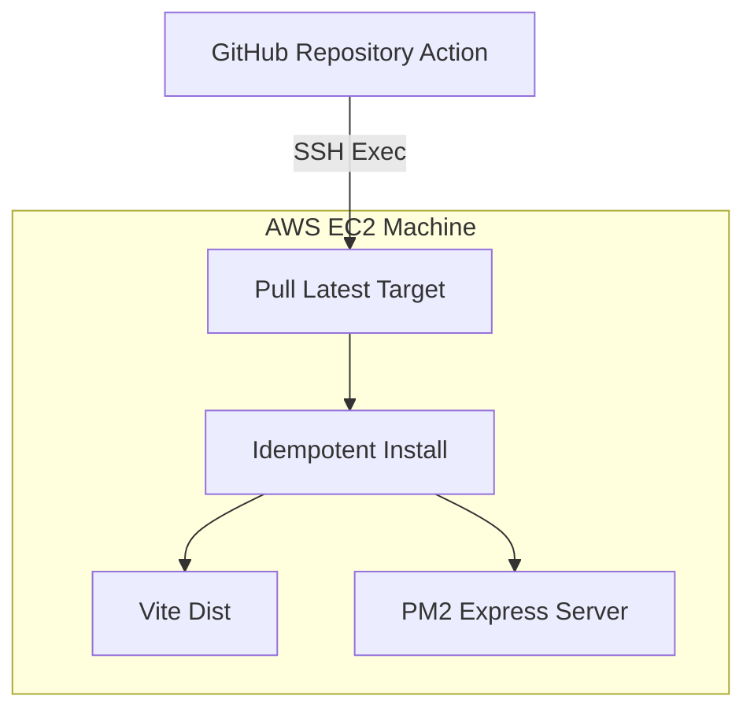

# ShopSmart 🛒

Welcome to ShopSmart. This is a full-stack, architecturally decoupled e-commerce application serving a beautiful "Electric Fizz" design interface, backed by a robust and entirely isolated backend REST service. 

Below is a quick overview of how we've modeled the system's infrastructure and core components.

## System Overview

ShopSmart uses a classic decoupled stack to ensure maximum scalability and ease of deployment. The frontend is powered by Vite and React for high-performance rendering. The backend is a Node.js and Express monolith utilizing Prisma ORM to communicate cleanly with our PostgreSQL cloud instances. 

We maintain strict versioning and rapid testing feedback via GitHub Actions before letting our code hit any production deployments.

---

## Architecture Diagram

Our physical structure operates on independent clusters. The client loads natively in the browser, issuing HTTP requests seamlessly to the backend API via standard REST architecture.

---

## CI/CD Workflow

On every PR or commit to `main`, our GitHub Actions pipeline establishes a containerized runner. It concurrently spins up multiple Node environments, builds the frontend chunk outputs, regenerates the Prisma schemas, and successfully runs the root unit and integration test assertions using Jest.

---

## Request Flow

When an interaction happens on the browser (e.g., authenticating or retrieving item features), the request trickles through the middleware layers before finally resting in PostgreSQL. Responses reverse the chain carrying JWT tokens or JSON schemas.

---

## Deployment Flow (AWS EC2 / Render)

To deploy, code pushes trigger external remote environments via GitHub Actions (utilizing secure SSH configurations targeting our AWS EC2 clusters). The idempotent bash scripts located in `scripts/deploy.sh` govern secure builds, dependency extraction, and cache mapping without mutating underlying production files violently.

---

## Architectural Choices & Challenges

**Workflow Decisions & Pipeline Requirements:**
We incorporated aggressive CI/CD workflows spanning across tests, frontend mapping, automatic lint check enforcement via `.eslintrc.json`, and dynamic Dependabot patching. The layout mirrors an academic, strictly separated structure optimizing for both API consumption and view components cleanly decoupled (E.g., `client/src/components` vs `client/src/services/api.js`).

**Technical Challenges & Resolutions:**
1. **Security Constraints:** Passing authentications cleanly involved designing JWT abstraction barriers.
2. **State Drilling:** Instead of bloated Redux trees, we explicitly leaned into functional Hook arrays mapping through encapsulated components securely (`UserList`, `Layout`).
3. **E2E Testing Simulation:** Capturing rendering flows without heavy Selenium arrays was bypassed beautifully using Cypress (`cypress/e2e/auth.cy.js`) intercepts, seamlessly mocking server nodes.
