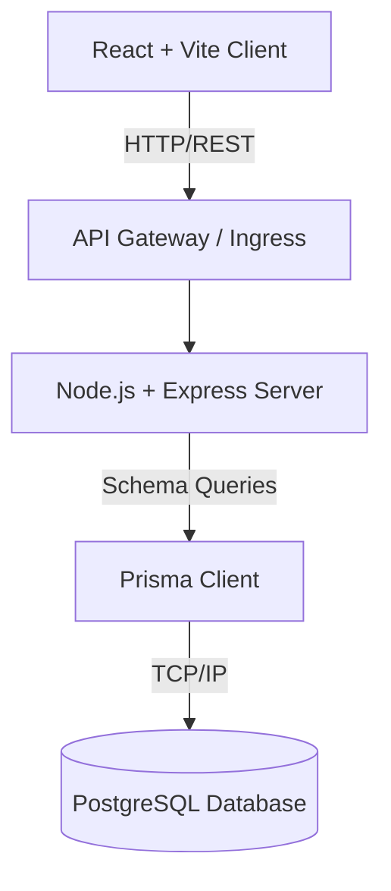
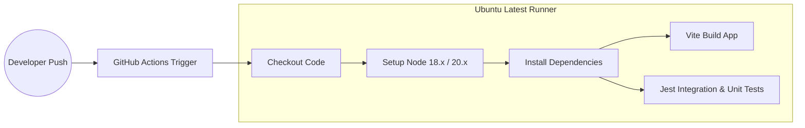
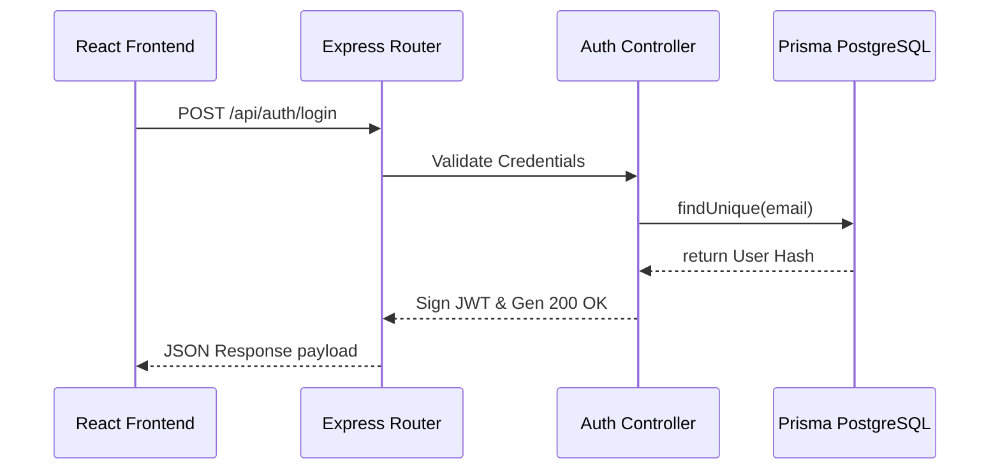
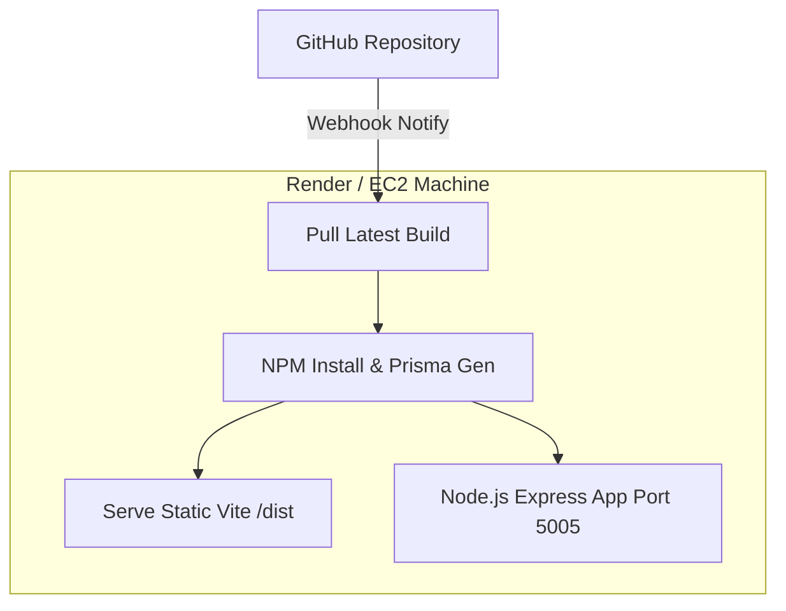
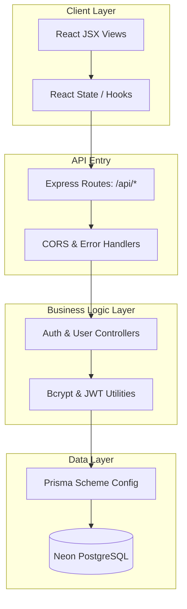

# ShopSmart 🛒

Welcome to ShopSmart. This is a full-stack, architecturally decoupled e-commerce application serving a beautiful "Electric Fizz" design interface, backed by a robust and entirely isolated backend REST service. 

Below is a quick overview of how we've modeled the system's infrastructure and core components.

## System Overview

ShopSmart uses a classic decoupled stack to ensure maximum scalability and ease of deployment. The frontend is powered by Vite and React for high-performance rendering. The backend is a Node.js and Express monolith utilizing Prisma ORM to communicate cleanly with our PostgreSQL cloud instances. 

We maintain strict versioning and rapid testing feedback via GitHub Actions before letting our code hit any production deployments.

---

## Architecture Diagram

Our physical structure operates on independent clusters. The client loads natively in the browser, issuing HTTP requests seamlessly to the backend API via standard REST architecture.

---

## CI/CD Workflow

On every PR or commit to `main`, our GitHub Actions pipeline establishes a containerized runner. It concurrently spins up multiple Node environments, builds the frontend chunk outputs, regenerates the Prisma schemas, and successfully runs the root unit and integration test assertions using Jest.

---

## Request Flow

When an interaction happens on the browser (e.g., authenticating or retrieving item features), the request trickles through the middleware layers before finally resting in PostgreSQL. Responses reverse the chain carrying JWT tokens or JSON schemas.

---

## Deployment Flow

To deploy, code pushes trigger external remote environments (Render or AWS EC2). The server spins up listening on port `5005`, resolving environment variable injectors locally while the static `dist/` directory serves the web artifacts rapidly.

---

## System Layers

In the backend ecosystem specifically, we embrace a distinct layered approach. This isolates our route configuration (the entry points) from our business logic (the controllers), which stays strictly isolated from the data layer logic (Prisma).

